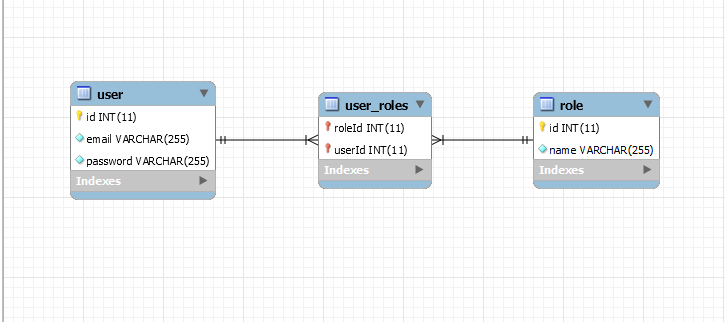

# Authentication Service

Simple API to handle user authentication

## Built with:
- Node.js
- Typescript
- Express.js
- TypeORM

## Database Diagram:

## Endpoints:
- POST   ----  /auth/signUp
- POST   ----  /auth/signIn
- GET    ----  /auth/refresh
- GET    ----  /auth/verify
- GET    ----  /user/
- PUT    ----  /user/
- DELETE ----  /user/
- POST   ----  /user/role
- DELETE ----  /user/role
- GET    ----  /role/
- POST   ----  /role/
- DELETE ----  /role/:id
- GET    ----  /role/:id